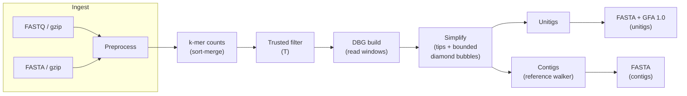

# Trex architecture (Phase-1 Illumina)

This document tracks the **Illumina de Bruijn / contigging** pipeline and how it maps to repository crates. Checkpoint I/O is summarized here with a pointer to stage anchors in `CONTEXT.md` (**Phase-1 checkpoint layout anchor**); finer on-disk layouts may evolve in ADRs.

## Workspace

| Crate | Role |
|-------|------|
| `trex` | Synchronous library: ingest, preprocess, *k*-mer counts, DBG build/simplify, unitigs/contigs, exports, checkpoint helpers. |
| `trex-cli` | Tokio CLI: async file reads, `spawn_blocking` into `trex::illumina::pipeline::assemble_illumina`. |

## Illumina dataflow (Phase-1 contigging IR)

**CPU / async boundary**: all heavy CPU work runs inside the library on blocking threads (`trex-cli` uses `tokio::task::spawn_blocking`).

## Checkpoints (operator-visible stages)

When `--checkpoint-root` is set, the pipeline may persist:

- `preprocess/reads.jsonl` — preprocessed reads.
- `counts/kmer_counts.json` — merged canonical *k*-mer counts for a given *k*.
- `graph/simplified_dbg.json` — simplified **DBG** (after tip + diamond bubble rules), optional `graph/manifest.json` with SHA-256 when `--strict-checkpoints` is on at write time. Rewriting the graph checkpoint clears a stale `export/` tree.
- `export/sequences.json` — stitched **unitigs** and **contigs** (ASCII **ACGT**), optional `export/manifest.json` in strict mode. Unitig stitching walks canonical *k*-mers per unitig and picks the lexicographically smallest valid full sequence when multiple strand orientations are consistent with read-derived forward representatives (`dbg::unitig::stitch_sequence`). **GFA 1.0** export may include **`P`** lines mapping each **primary contig** to **unitig** `S` segments when the contig's vertex path is a concatenation of **full** unitig paths (greedy partition) or exactly matches one unitig path (forward/reverse); see `dbg::export::primary_contig_paths_for_gfa`. With **`--diploid`**, optional mirror **`P`** rows named `p2h000001`, … carry the same walk with **`TS:Z:trex-unphased-hap-mirror`** (unphased dual-path placeholder).
- `preprocess/pair_layout.json` — when paired-end reads are ingested, records **`r1_count`** so resume can restore **Phase-2** mate-bridge identity alongside `reads.jsonl`.

With `--resume`, the graph stage reloads from `graph/simplified_dbg.json` when *k* matches and (in strict mode) the manifest digest matches; otherwise it rebuilds from reads + trusted counts and overwrites the graph checkpoint. The export stage reloads from `export/sequences.json` when present and *k* matches, skipping unitig/contig stitching when valid.

## Errors

Public errors use `thiserror` with `#[non_exhaustive]` on `TrexError`, `IngestError`, `KmerError`, `CheckpointError`, and `GraphError` per **Phase-1 error typing**.

## Unsafe policy

The `trex` crate sets `#![forbid(unsafe_code)]`. Any future SIMD or FFI belongs in `trex-sys-*` / `trex-simd-*` crates per **Phase-1 unsafe policy**.

## Phase-2 Illumina (contract vs code)

Product vocabulary and gates for **Phase-2 Illumina** (primary FASTA + **GFA** diploid structure, layered benchmarks, CLI selectors, synthetic CI truth) live in **`CONTEXT.md`**. This repository wires the **Phase-2 Illumina benchmark gate** shell contract in **`scripts/phase2_illumina_benchmark_gate.sh`**: it runs the **Phase-1** `scripts/benchmark_gate.sh`, **`scripts/phase2_illumina_diploid_reference_layer.sh`**, **`scripts/phase2_illumina_graph_summaries.sh`**, and **`scripts/phase2_illumina_haplotype_metrics.sh`** (best-parent Hamming on **`contigs.fa`** vs the two synthetic parents). Optional **QUAST** is behind `TREX_RUN_QUAST=1` + **`scripts/reference_quast.sh`**. **Shipped (experimental):** `trex illumina assemble --diploid` / `[assemble.diploid]`, insert prior fields on `AssembleParams` for checkpoint identity, **mate-pair bridge** that boosts **existing** DBG edges (R1 last / R2 first canonical *k*-mer) when diploid + paired + insert mean is set, **primary FASTA** trusted *k*-mer multiplicity collapse, multi-segment **`P`** when the contig vertex path is a full-unitig concatenation, **`p2h…`** mirror **`P`** lines, diamond simplification that **retains** near-balanced branches, **`XX:Z:trex-phase2-illumina`** on the GFA `H` line, optional diploid **`L`** rows, and unitig stitching with dual-orientation search. **Still future / narrower:** distance-sensitive bubble surgery from insert distributions (beyond edge boost), rich phased **GFA** walks across haplotypes, and mandatory **QUAST** on default CI without opt-in.
