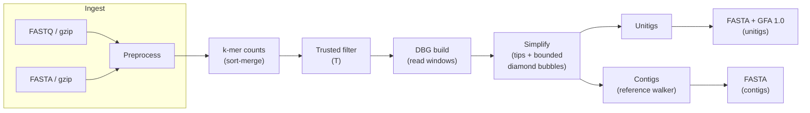

# Trex architecture (Phase-1 Illumina)

This document tracks the **Illumina de Bruijn / contigging** pipeline and how it maps to repository crates. Checkpoint I/O is summarized here with a pointer to stage anchors in `CONTEXT.md` (**Phase-1 checkpoint layout anchor**); finer on-disk layouts may evolve in ADRs.

## Workspace

| Crate | Role |
|-------|------|
| `trex` | Synchronous library: ingest, preprocess, *k*-mer counts, DBG build/simplify, unitigs/contigs, exports, checkpoint helpers. |
| `trex-cli` | Tokio CLI: async file reads, `spawn_blocking` into `trex::illumina::pipeline::assemble_illumina`. |

## Illumina dataflow (Phase-1 contigging IR)



**CPU / async boundary**: all heavy CPU work runs inside the library on blocking threads (`trex-cli` uses `tokio::task::spawn_blocking`).

## Stage Contracts

`trex::illumina::pipeline::assemble_illumina` is the single end-to-end library entrypoint for the current assembler. It is synchronous and takes an `AssembleParams` value assembled by `trex-cli`.

1. **Read ingest**: `load_reads` reads R1 and optional R2 with `read_maybe_gzip`, dispatches by suffix to FASTQ or FASTA parsing, then applies preprocess normalization. Paired-end input remains two explicit files; R1 and R2 are concatenated only after `validate_pair_parity` proves count and header identity.
2. **Feasibility gate**: after preprocess, the shortest retained read must be at least `k`. An empty read set or impossible `k` returns a typed ingest error before enumeration.
3. **Counts**: `enumerate_sorted_counts` emits the sorted canonical *k*-mer count table. `apply_trusted_threshold` applies the single global `T`; no Phase-2 selector changes this table or the trusted vertex set.
4. **DBG construction**: `build_dbg` consumes reads, `k`, and trusted *k*-mers to build the Phase-1 de Bruijn graph. Read-derived forward representatives are captured separately for later sequence stitching.
5. **Optional Phase-2 mate bridge**: only when `--diploid`, paired-end input, and `insert_mean_bp` are all present, `mate::boost_mate_pairs_on_existing_dbg_edges` may increment weights on existing graph edges. It does not add vertices, add new edges, change canonical counts, or change trusted membership.
6. **Simplification**: `remove_tips` applies Phase-1 length and multiplicity bounds. `remove_diamond_bubbles_ext` resolves bounded diamond bubbles in Phase-1 mode; in Phase-2 diploid mode it leaves near-balanced branches intact.
7. **Invariant gate**: `assert_no_self_loops` runs after simplification. A self-adjacent edge is fatal, not silently repaired.
8. **Unitigs and contigs**: `extract_unitigs` produces graph-faithful unitig paths. `reference_contig_paths` produces one vertex-simple reference contig walk per component. Phase-2 mode uses `ContigWalkTieBreak::Phase2DiploidNodeMul`; Phase-1 uses lexicographic tie-breaks.
9. **Primary collapse**: only in Phase-2 mode, `phase2_primary::collapse_primary_contig_by_trusted_kmers` rewrites primary contig FASTA sequence columns by trusted *k*-mer multiplicity voting over A/C/G/T. It does not emit IUPAC or `N` for simple heterozygous collapse.
10. **Export**: unitigs and contigs are written as FASTA, and unitigs plus optional paths/links are written as GFA 1.0.

## Phase-2 Illumina Overlay

Phase-2 Illumina is an explicit overlay on the Phase-1 Illumina pipeline, not a separate assembler path. The selector is `trex illumina assemble --diploid` or `[assemble.diploid].enabled = true`.

```mermaid
flowchart LR
  reads["preprocessed reads\nsame Phase-1 rules"] --> counts["canonical counts\nsame k and T"]
  counts --> graph["trusted DBG\nsame vertex set"]
  graph --> bridge{"diploid + PE\n+ insert mean?"}
  bridge -- no --> simplify["tip clipping +\ndiamond handling"]
  bridge -- yes --> edgeboost["boost existing\nR1-last/R2-first edges"]
  edgeboost --> simplify
  simplify --> retain["near-balanced diamonds\nretained in diploid mode"]
  retain --> walks["unitigs + primary contig walks"]
  walks --> collapse["primary FASTA\nA/C/G/T collapse"]
  walks --> gfa["GFA 1.0\nH/S/L/P + p2h mirrors"]
  collapse --> fasta["contigs.fa"]
```

### Counting Boundary

The Phase-2 selector does not change `Phase-1 k-mer count representation`, `Phase-1 trusted k-mer rule`, canonical identity, N splitting, sorting, or thresholding. This is the main architectural boundary: diploid-specific logic starts after the trusted graph exists.

This keeps Phase-2 experimentation from invalidating Phase-1 count semantics and makes checkpoint reuse tractable. If future work needs PE-informed trust, local thresholds, or multi-*k*, it is a Phase-1 replan, not an incremental Phase-2 extension.

### Mate Bridge

`trex::illumina::mate` implements the current conservative mate hook:

- Input identity comes from `preprocess/pair_layout.json`, which records the R1 count before R2 concatenation.
- For each pair, the bridge takes the last canonical *k*-mer from R1 and the first canonical *k*-mer from R2.
- Both endpoints must already be trusted graph vertices.
- The edge between them must already exist in the DBG.
- A successful bridge increments only that edge weight by 1.

This is an adjacency-strength signal, not primary FASTA mutation and not distance-sensitive gap inference. `scaffolds.json` may promote high-confidence dead-end endpoint joins into sidecar scaffold/path records only when support is unconflicted, the endpoint is not in a competing join cluster, and the distance confidence clears the documented promotion threshold. When accepted scaffold paths exist, Trex also writes a separate `scaffolds.fa` sequence sidecar using explicit `N` gaps for positive mate-estimated distances and known DBG overlap trimming for existing-edge joins; it never replaces `contigs.fa`. The insert mean currently participates in mode identity and enables the bridge; richer insert-distribution bubble surgery is future work.

### Diploid Simplification

Phase-1 simplification removes low-coverage tips and resolves bounded diamond bubbles by branch support, using deterministic tie-breaks. The simplifier now runs through a SPAdes-inspired `spades_iterative_v1` scheduler that records pass order, before/after topology snapshots, graph-edit counts, and recompress/reannotation hook status in `simplification.json`; it does not yet add more aggressive cleanup. Repeat-aware guardrails retain diamonds with high-copy branch nodes before automatic collapse, recording `RetainRepeatGuardedDiamond` decisions in `simplification.json`. Phase-2 mode preserves the same topology and sequence budgets, but `remove_diamond_bubbles_ext` also skips collapsing branches whose support is equal or within 5% of the stronger branch. The intent is to preserve plausible heterozygous or repeat-derived alternatives instead of forcing a haploid collapse too early.

The current motif set is intentionally narrow: bounded diamonds only. Complex repeats, long bubbles, tangles, cyclic walks, and distance-aware bubble surgery stay outside the shipped automatic simplifier.

### Primary FASTA Collapse

The operator-facing primary FASTA remains a single `contigs.fa` stream. In Phase-2 mode, after contig stitching, every base is reconsidered against all overlapping length-*k* windows. For each candidate base A/C/G/T, Trex canonicalizes the resulting window and sums trusted multiplicity. The chosen base is the highest-scoring candidate, with A < C < G < T as the deterministic tie-break. If every candidate has zero trusted support, the stitched base is left unchanged.

This is a collapsed primary stream, not a phased pair of FASTA files. Haplotype-bearing structure belongs in GFA until the phasing ladder is explicitly extended.

### GFA 1.0 Surface

`dbg::export::write_gfa1` emits the current graph interchange:

- `H VN:Z:1.0` in default Phase-1 mode.
- `H VN:Z:1.0 XX:Z:trex-phase2-illumina` in Phase-2 mode.
- `S` records for unitigs using the same `utgNNNNNN` namespace as unitig FASTA headers.
- Optional Phase-2 `L` records for unitig-to-unitig adjacency derived from simplified graph edges.
- Primary `P` records named `ctgNNNNNN` when a contig vertex path can be represented as a full-unitig traversal.
- Phase-2 mirror `P` records named `p2hNNNNNN` with `TS:Z:trex-unphased-hap-mirror` and `XX:Z:<ctg id>`.
- Accepted scaffold sidecar `P` records named `scfNNNNNN` with `TS:Z:trex-scaffold-sidecar` and `GF:Z:scaffolds.fa`.

`P` coverage is deliberately spec-safe rather than exhaustive. Strict subpaths of a unitig currently do not emit trimmed `P` rows; downstream consumers should treat the `S`/`L` graph plus current `P` rows as the inspectable diploid carrier, not as full phased haplotype walks.

### Scaffold FASTA Sidecar

`scaffolds.fa` is emitted only when accepted scaffold paths exist. It is a separate scaffolded sequence product, not the primary stream. Existing DBG-edge joins trim the documented overlap; promoted absent-edge joins insert explicit `N` gaps only when the mate-distance evidence estimates a positive gap. Negative or zero estimated gaps do not invent overlap sequence. The same accepted paths are projected into tagged GFA `P` rows named `scf...` for graph-aware consumers.

### Promotion Policy

`trex::illumina::promotion` is the policy seam between evidence and output-changing behavior. It currently owns endpoint-join promotion thresholds and rejection precedence before `trex::illumina::scaffold` builds `scaffolds.json`, `scaffolds.fa`, and tagged `scf...` GFA paths. This keeps tuning knobs such as minimum support, distance confidence, conflicting mate support, and competing endpoint clusters in one module instead of spreading them across path construction and export code.

## Checkpoints (operator-visible stages)

When `--checkpoint-root` is set, the pipeline may persist:

- `preprocess/reads.jsonl` — preprocessed reads.
- `counts/kmer_counts.json` — merged canonical *k*-mer counts for a given *k*.
- `graph/simplified_dbg.json` — simplified **DBG** (after the scheduled tip + diamond bubble passes), optional `graph/manifest.json` with SHA-256 when `--strict-checkpoints` is on at write time. Rewriting the graph checkpoint clears a stale `export/` tree.
- `export/sequences.json` — stitched **unitigs** and **contigs** (ASCII **ACGT**), optional `export/manifest.json` in strict mode. Unitig stitching walks canonical *k*-mers per unitig and picks the lexicographically smallest valid full sequence when multiple strand orientations are consistent with read-derived forward representatives (`dbg::unitig::stitch_sequence`). **GFA 1.0** export may include **`P`** lines mapping each **primary contig** to **unitig** `S` segments when the contig's vertex path is a concatenation of **full** unitig paths (greedy partition) or exactly matches one unitig path (forward/reverse); see `dbg::export::primary_contig_paths_for_gfa`. With **`--diploid`**, optional mirror **`P`** rows named `p2h000001`, … carry the same walk with **`TS:Z:trex-unphased-hap-mirror`** (unphased dual-path placeholder).
- `preprocess/pair_layout.json` — when paired-end reads are ingested, records **`r1_count`** so resume can restore **Phase-2** mate-bridge identity alongside `reads.jsonl`.

With `--resume`, the graph stage reloads from `graph/simplified_dbg.json` when *k* matches and (in strict mode) the manifest digest matches; otherwise it rebuilds from reads + trusted counts and overwrites the graph checkpoint. The export stage reloads from `export/sequences.json` when present and *k* matches, skipping unitig/contig stitching when valid.

### Resume Identity

Counts checkpoints are keyed by `k` and store merged counts before the trusted threshold is applied. This lets an operator change `T` and rebuild downstream stages without rereading raw inputs. In explicit multi-*k* or `--auto-k` mode, preprocess checkpoints stay at the requested root while selected-*k* counts, graph, and export checkpoints are written under `selected-k-<k>/` to prevent cross-*k* reuse on resume.

Graph checkpoints are stricter. In addition to `k`, `GraphCheckpointIdentity` must match:

- `diploid_enabled`
- `diploid_paired_end`
- `diploid_insert_mean_bp`
- `diploid_insert_stddev_bp`
- `phase2_mate_bridge_v1`

A mismatch returns `None` to the pipeline loader, which rebuilds the graph from reads and trusted counts. Rewriting the graph checkpoint removes stale export checkpoints because unitig and contig sequences are downstream of graph topology and edge weights.

Export checkpoints store stitched unitigs and contigs as ASCII A/C/G/T. They are reloadable by `k`, but path metadata is recomputed from the graph on resume for GFA export.

## CLI and Configuration

The public operator surface is one binary and one Illumina assemble command:

```bash
trex illumina assemble --r1 reads.fq --kmer-size 31 --out-dir run
trex illumina assemble --r1 reads.fq --auto-k --out-dir run
trex illumina assemble --r1 r1.fq --r2 r2.fq --kmer-size 31 --diploid --insert-mean-bp 350 --out-dir run
```

The optional TOML config accepts either flat assemble keys or an `[assemble]` table. CLI flags override config fields, config fields override built-in defaults, and `--no-resume` / `--no-strict-checkpoints` force those booleans off even if the config sets them.

`--auto-k` derives a deterministic odd-*k* candidate ladder from the shortest retained read, scores it with the same selector used by `--kmer-ladder`, emits `multi_k.json`, and assembles only the selected graph. It does not merge candidate graphs. When checkpoints are enabled, selected graph artifacts are isolated under `selected-k-<k>/`.

Built-in defaults that matter architecturally:

- `trusted_threshold = 2`
- output filenames `unitigs.fa`, `contigs.fa`, `graph.gfa`
- resume and strict checkpoints off
- diploid mode off
- simplification bounds derived from `k` unless overridden

## Benchmark and CI Gates

The Phase-2 Illumina gate is layered rather than replacing Phase-1:

1. `scripts/benchmark_gate.sh` runs the Phase-1 gate first.
2. `scripts/phase2_illumina_diploid_reference_layer.sh` checks the synthetic two-parent fixture and pinned provenance.
3. `scripts/phase2_illumina_graph_summaries.sh` assembles with `--diploid` and checks GFA/primary summary expectations.
4. `scripts/phase2_illumina_haplotype_metrics.sh` compares `contigs.fa` to both synthetic parents using best-parent Hamming-style checks.

Optional QUAST is guarded by `TREX_RUN_QUAST=1` and `scripts/reference_quast.sh`; it is not required for the default CI diploid path.

## Errors

Public errors use `thiserror` with `#[non_exhaustive]` on `TrexError`, `IngestError`, `KmerError`, `CheckpointError`, and `GraphError` per **Phase-1 error typing**.

## Unsafe policy

The `trex` crate sets `#![forbid(unsafe_code)]`. Any future SIMD or FFI belongs in `trex-sys-*` / `trex-simd-*` crates per **Phase-1 unsafe policy**.

## Current Boundaries

Shipped experimental Phase-2 Illumina functionality:

- `trex illumina assemble --diploid` and `[assemble.diploid]`
- graph checkpoint identity for diploid mode, paired input, insert prior fields, and mate-bridge version
- mate-pair bridge on existing DBG edges only
- conflict-aware endpoint join acceptance in `scaffolds.json` sidecar paths
- separate `scaffolds.fa` sidecar from accepted scaffold paths
- near-balanced diamond retention
- repeat-aware diamond-retention guardrail
- primary FASTA trusted *k*-mer multiplicity collapse
- GFA 1.0 `XX:Z:trex-phase2-illumina` header tag
- optional diploid `L` rows
- primary `ctg...` `P` rows where full-unitig partitioning is possible
- `p2h...` unphased mirror `P` rows
- synthetic two-parent Phase-2 benchmark scripts

Explicitly future or out of scope without a new glossary or ADR decision:

- PE-informed *k*-mer enumeration or trust thresholds
- local trusted threshold relaxation
- multi-*k* ladders
- adding mate-derived graph edges that were not already present
- numeric scaffold gaps or `U` records inferred from an implicit insert model
- distance-sensitive bubble surgery from insert distributions
- rich phased haplotype walks or mandatory dual FASTA haplotypes
- GFA 2 as the default interchange
- long-read, hybrid, HiFi, CLR, or ONT assembly paths
- mandatory QUAST in the default CI diploid gate
